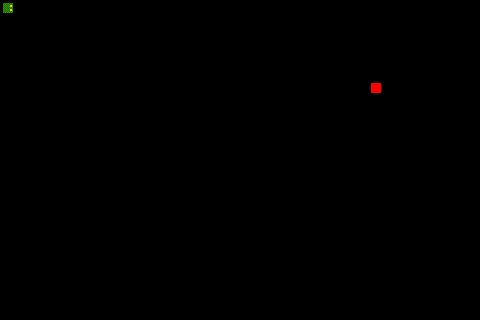

# Snake Solver



This program solves snake.
No bullshit machine learning, just a raw best-first search over the state space, guided by manual heuristics.

See [snake.py](snake.py) is the actual code that runs the search.
The notebook [Snake.ipynb](Snake.ipynb) gives an example for how to use it.

There's a bunch of dependencies in this thing, I'm not sure if this is all of them but here's at least most of them.
(I'll add a requirements file later with all the exact specifics.)

```
numpy
scipy
scikit-image
Pillow
tqdm
```


